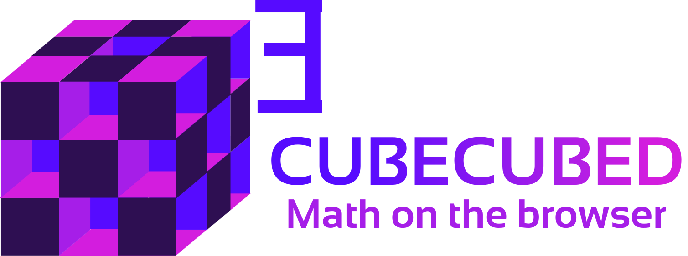

<!-- # Cubecubed - A Math Visualization Engine -->

<p align="center">
  
  <h1 align="center">Cubecubed - A Math Visualization Engine</h1>
  <p align="center">
    <a href="https://www.npmjs.com/package/cubecubed">
      
      
      
      
      
      
    </a>
  </p>
  <p align="center">
    <a href="https://www.npmjs.com/package/cubecubed">
          
    </a>
  </p>
</p>

Cubecubed is designed to be an intuitive and easy-to-use math visualization engine for students, teachers, enthusiastic math lovers and anyone who is curious about the subject. It utilizes the powerful SVG manipulation system of [D3.js](https://github.com/d3/d3) and the marvelous graphical capabilities of [p5.js](https://github.com/processing/p5.js) library to create a visual representation of math concepts.

Though Cubecubed is deeply inspired by [Manim](https://github.com/3b1b/manim) - _an animation engine for explanatory math videos_ written in Python, it's not a port or a re-implementation of the engine. Cubecubed specifically focuses on playing dynamic animations right on the browser, with the intensive use of SVG and HTML Canvas.

Cubecubed believes the best way to learn and discover math is through the combining process of visualizations and deductive reasoning. If we write math on paper, why don't we write it on a computer?

## 💤 Name Explanation

Imagine that a 3d cube multiply by itself two times — That's it!

## 💡 Initialize Project

Getting started with Cubecubed is easily easy, you can run either

```sh
npx cubecubed
```

or

```sh
npx ccw # `ccw` stands for "create Cubecubed workspace".
```

## 🚀 Quick Start

To get started with Cubecubed, see this [Quick Start](https://imaphatduc.github.io/cubecubed/#/quickstart) page.

## 🔎 Documentation

Documentation website is [here](https://imaphatduc.github.io/cubecubed)!

## ✨ Contributing

Whether you have great feature ideas in mind or recognize bugs, feel free to contribute to Cubecubed. Any contribution to the Cubecubed is appreciated. Please read [contributing guidelines](https://github.com/imaphatduc/cubecubed/blob/master/CONTRIBUTING.md) before raising an issue or submitting a pull request. With every contribution, we are striving to make Cubecubed better.

## 🥳 Stargazers

Big thanks to all of these awesome people.

<a href="https://github.com/imaphatduc/cubecubed/graphs/contributors">
  
</a>

## ❄️ License

This project falls under the [MIT license](https://github.com/imaphatduc/cubecubed/blob/master/LICENSE).
