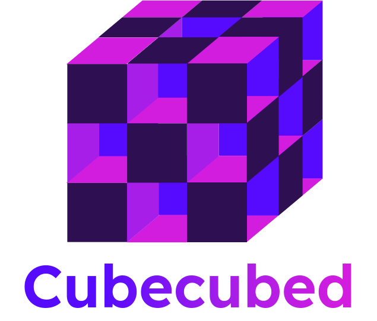

<!-- # Cubecubed - A Math Visualization Engine -->

<p align="center">
  
  <p align="center">A mathematical visualization library for playing dynamic animations right on your favorite browser. Built with "simple and intuitive" philosophy in mind.</p>
  <h4 align="center">Imagine 💡 → Launch 🚀 → Watch 🍿</h4>
  <hr>
  <p align="center">
    <a href="https://www.npmjs.com/package/cubecubed">
      
      
      
      
      
      
    </a>
  </p>
  <p align="center">
    <a href="https://www.npmjs.com/package/cubecubed">
      
      
      
    </a>
  </p>
</p>

## 💡 About the project

Cubecubed produces high-performance animations and graphical effects soothing to the eyes.

## 💤 Name Explanation

Imagine that a 3d cube is multiplied by itself two times — That's it!

## Core features

- **Animation engine**: Flexible and well-organized animtion controls. You don't need to explicitly manipulate time for each animation, as it is controlled behind the scene.

- **Video exports**: Export any scene to video files.

- **2D and 3D rendering**: Cubecubed utilizes the powerful SVG manipulation abilities of [D3.js](https://github.com/d3/d3), along with the marvelous 3D graphical system of [three.js](https://github.com/mrdoob/three.js) library to create a visual representation of math concepts.

## 🚀 Getting Started

### Setup

Getting started with Cubecubed is easily easy, you can run this command to initialiize a workspace.

```sh
# `ccw` stands for `create cubecubed workspace`
$ npx ccw my-workspace
```

### Develop

Now you will see the animations in action!

```sh
$ npm run dev
```

See this [Quick Start](https://imaphatduc.github.io/cubecubed/#/quickstart) page for detailed information.

## 🗒️ Notes

### Who should use Cubecubed?

Anyone! Whether you are students, teachers, researchers, or someone who is curious about mathematics, you can use Cubecubed or any visualization tools out there to explore its mystical beauty.

### Inspiration

Cubecubed exists for a reason. Check out this [article](https://dev.to/imaphatduc/my-story-with-cubecubed-2da2) to figure it out.

Cubecubed is deeply inspired by [Manim](https://github.com/3b1b/manim) - _an animation engine for explanatory math videos_. However, it is not a port or a re-implementation of the engine. The first commit of Cubecubed was made by author [@imaphatduc](https://github.com/imaphatduc) on December 1, 2021. More features are coming soon...

### "Cubecubed UI"

[Cubedbook](https://github.com/imaphatduc/cubedbook) is built on top of Cubecubed to provide a user-friendly GUI environment. If you're not comfortable with programming, Cubedbook is an option for you.

### Footnote

Cubecubed believes the best way to learn and discover math is through the combining process of visualizations and deductive reasoning. If we write math on paper, why don't we write it on a computer?

## ☄ Contributing

Cubecubed welcomes all contributors! Whether you have great feature ideas in mind or recognize bugs, feel free to contribute to the project. But first, please read these [contributing guidelines](https://github.com/imaphatduc/cubecubed/blob/master/CONTRIBUTING.md) and check the `issues` and `pull requests` tabs to prevent any duplications.

## 🥳 Contributors

Big thanks to all of these awesome people.

<a href="https://github.com/imaphatduc/cubecubed/graphs/contributors">
  
</a>

## ❄️ License

This project is cubed under [MIT license](https://github.com/imaphatduc/cubecubed/blob/master/LICENSE).
